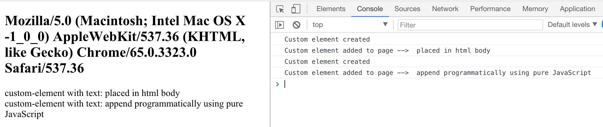
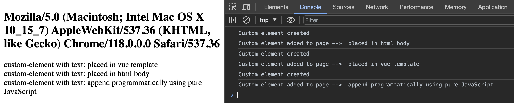
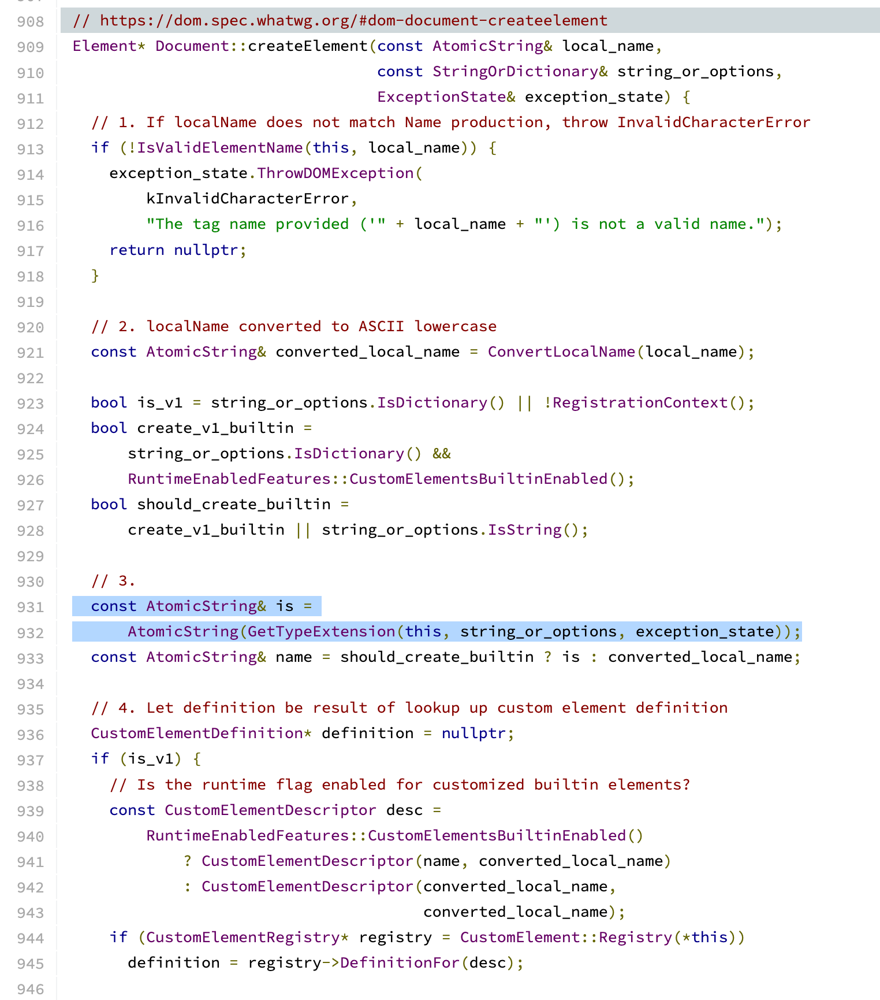
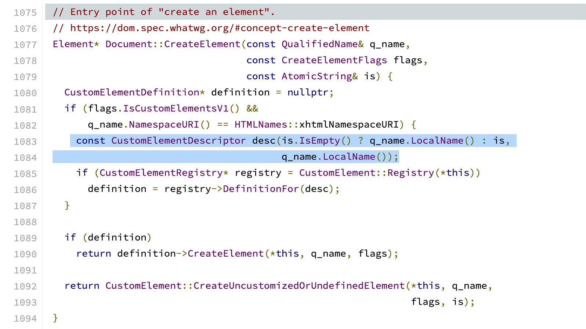
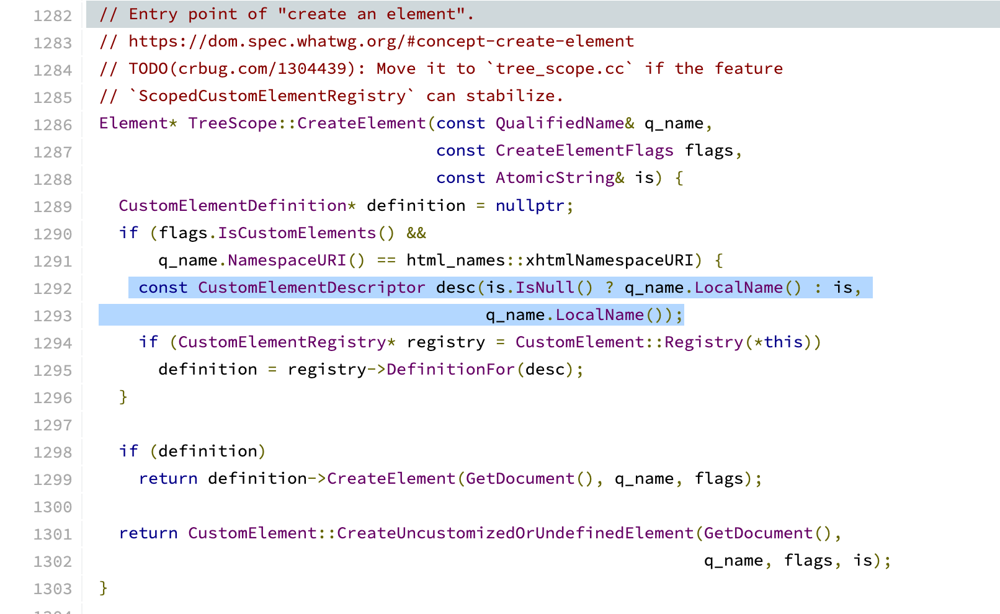
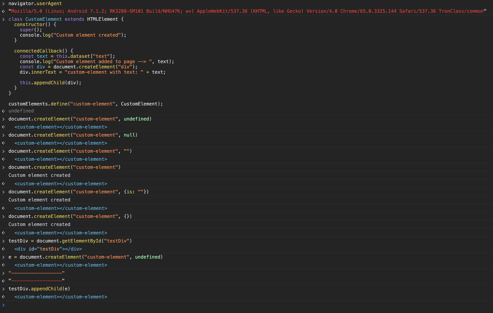
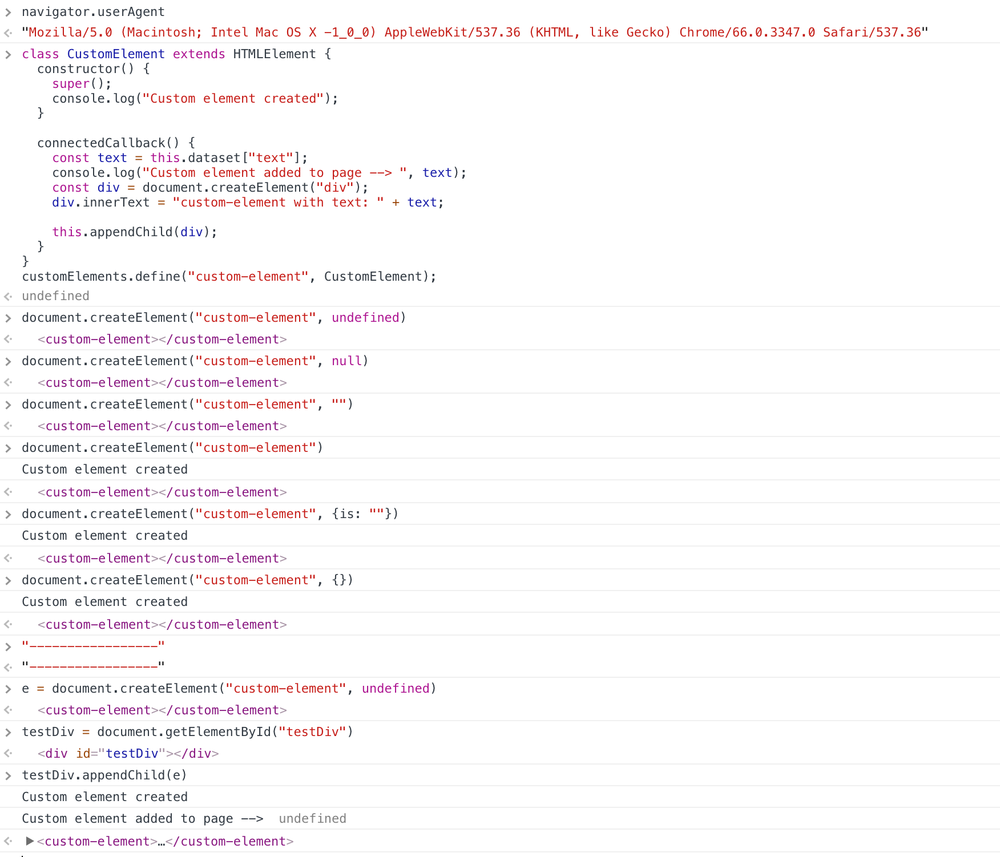
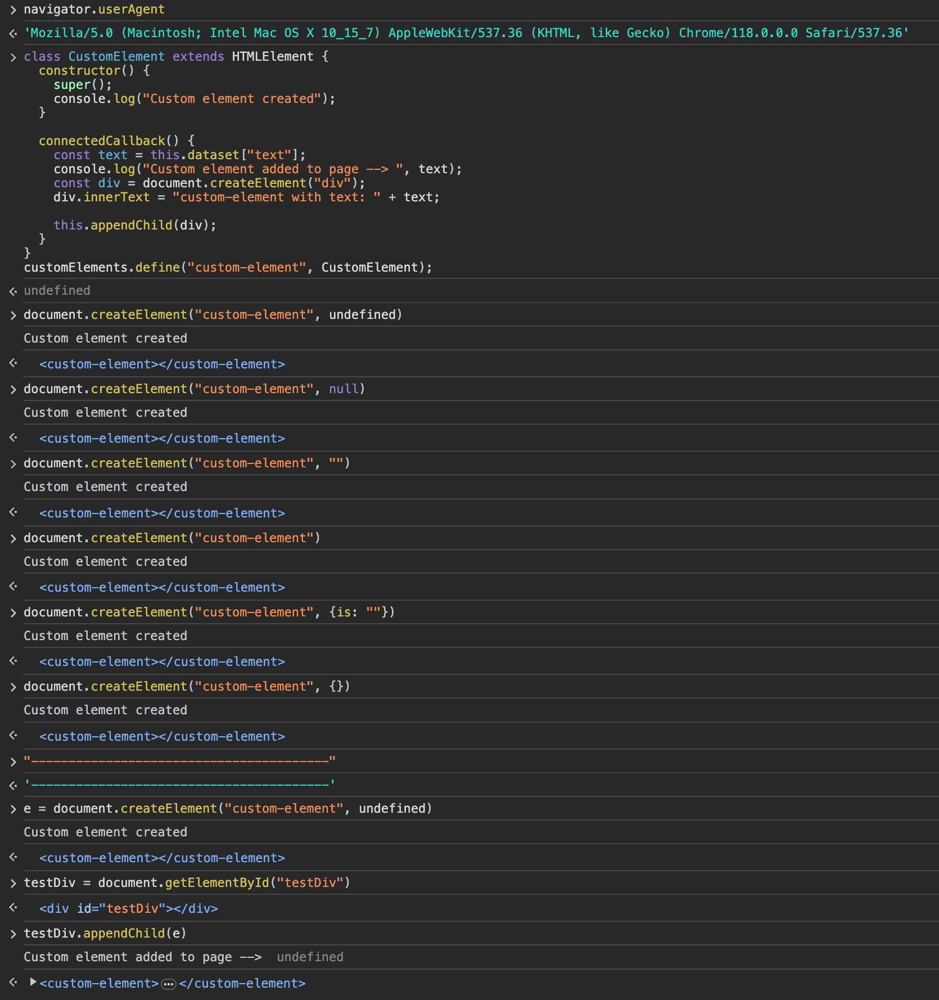

# Demo https://vue3-custom-component.vercel.app/

# Issue 
Vue3 custom element (Web Component) does not render below Chrome 65 (Android 8 built-in webview)

# Reason
When `isCustomizedBuiltIn` is false, Vue3 passes `undefined` as the second argument to `document.createElement` through `nodeOps.createElement` when the built-in tag name is not used as a custom element. This usage does not work in Chrome versions prior to 66, meaning that the `constructor` and `connectedCallback` of the custom element will not be triggered.

Interestingly, starting from version 66, the `constructor` will not be triggered upon creation, but when appended to the DOM, the `constructor` and `connectedCallback` will be triggered in sequence, allowing it to function properly. In the latest version, the `constructor` will be triggered upon creation, and when appended to the DOM, the `connectedCallback` will be triggered.

# Temporary solution
```javascript
// file: index.html
// patch the createElement to avoid options is nullish
var _createElement = window.document.createElement;
window.document.createElement = function (tagName, options) {
    if (options) {
        return _createElement.call(window.document, tagName, options);
    } else {
        return _createElement.call(window.document, tagName);
    }
}
```

# Debug Progress

### Demo Showcase

#### Demo custom element code
```javascript
// file: src/custom-element.ts
class CustomElement extends HTMLElement {
  constructor() {
    super();
    console.log("Custom element created");
  }

  connectedCallback() {
    const text = this.dataset["text"];
    console.log("Custom element added to page --> ", text);
    const div = document.createElement("div");
    div.innerText = "custom-element with text: " + text;

    this.appendChild(div);
  }
}

customElements.define("custom-element", CustomElement);
```

#### Demo Result

**Chrome/65.0.3325.144**



**Chrome/66.0.3347.0**


**Chrome/118.0.0.0**



### Chromium Source Code Changes
[chromium version: 65.0.3323.3](https://chromium.googlesource.com/chromium/src/+/470d3a6be2f380affa8de3dc0dd1508f3eeba9f7/third_party/WebKit/Source/core/dom/Document.cpp#908)



[chromium version: 66.0.3347.3](https://chromium.googlesource.com/chromium/src/+/3b9cfdda2eb80dab7457ec61e619dd910d194248/third_party/WebKit/Source/core/dom/Document.cpp#1075)



[chromium version 121.0.61313.1](https://chromium.googlesource.com/chromium/src/+/refs/tags/121.0.6131.1/third_party/blink/renderer/core/dom/document.cc#1282)




### Console Debug

**Chrome/65.0.3325.144**



**Chrome/66.0.3347.0**



**Chrome/118.0.0.0**




**Test Code**
```javascript
// define custom element
class CustomElement extends HTMLElement {
  constructor() {
    super();
    console.log("Custom element created");
  }

  connectedCallback() {
    const text = this.dataset["text"];
    console.log("Custom element added to page --> ", text);
    const div = document.createElement("div");
    div.innerText = "custom-element with text: " + text;

    this.appendChild(div);
  }
}
customElements.define("custom-element", CustomElement);


// create element with options undefined
e = document.createElement("custom-element", undefined)
// Chrome/65.0.3325.144 ❌ constructor not executed
// Chrome/66.0.3347.0 ⚠️ constructor not executed
// Chrome/118.0.0.0 ✅ constructor executed

// create element with options null
document.createElement("custom-element", null)
// Chrome/65.0.3325.144 ❌ constructor not executed
// Chrome/66.0.3347.0 ⚠️ constructor not executed
// Chrome/118.0.0.0 ✅ constructor executed

// create element with options string empty
document.createElement("custom-element", "")
// Chrome/65.0.3325.144 ❌ constructor not executed
// Chrome/66.0.3347.0 ⚠️ constructor not executed
// Chrome/118.0.0.0 ✅ constructor executed

// create element with out options
document.createElement("custom-element")
// Chrome/65.0.3325.144 ✅ constructor executed
// Chrome/66.0.3347.0 ✅ constructor executed
// Chrome/118.0.0.0 ✅ constructor executed

// create element with options {is: ""}
document.createElement("custom-element", {is: ""})
// Chrome/65.0.3325.144 ✅ constructor executed
// Chrome/66.0.3347.0 ✅ constructor executed
// Chrome/118.0.0.0 ✅ constructor executed

// create element with options empty object
document.createElement("custom-element", {})
// Chrome/65.0.3325.144 ✅ constructor executed
// Chrome/66.0.3347.0 ✅ constructor executed
// Chrome/118.0.0.0 ✅ constructor executed

// test appent to dom
testDiv = document.getElementById("testDiv")

testDiv.appendChild(e)
// Chrome/65.0.3325.144 ❌ constructor not executed && connectedCallback not executed
// Chrome/66.0.3347.0 ✅ constructor executed && connectedCallback executed
// Chrome/118.0.0.0 ✅ connectedCallback executed
```